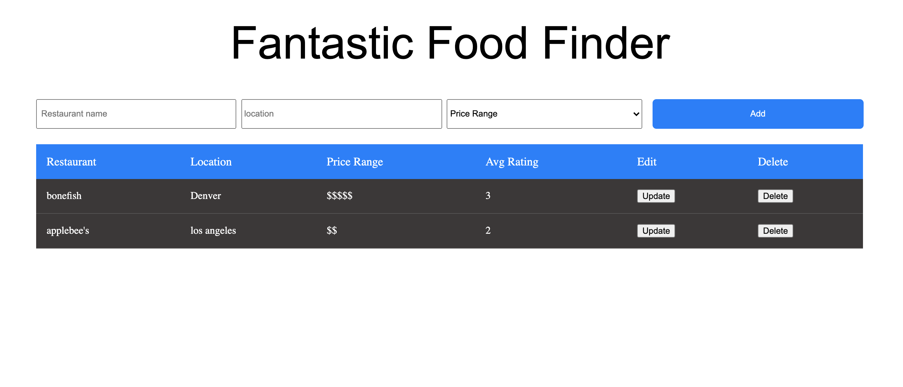
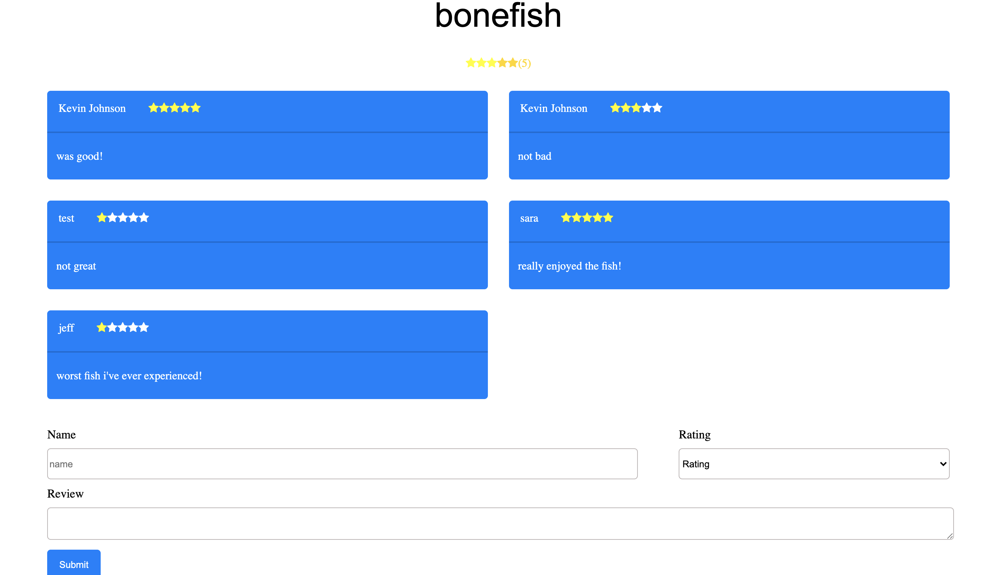

Live app: (https://food-finder-client-kevdev90.vercel.app/)
 
API Repo: (https://github.com/KevDev90/Food-Finder-Server)
## Table of Contents
- Summary
- Screenshots
- Technologies
## Summary- Fantastic Food Finder

Your one stop application for rating and leaving reviews about Restaurants you've visited!

Enter a Restaurant name and location in the text inputs, and then select a price range. After that, click the add button after all the information is filled out to add the Restaurant to the table!

On a mobile view you can scroll horizontally to see the full list of Restaurants!

You can also Edit and Delete a Restaurant after creating it through the buttons on the Restaurant row!

After creating a Restaurant you can click anywhere on that Restaurants row in the table to write a review and rate that particular Restaurant!

Bon Appetit!

## Screenshots
### Landing Page 

### Main Restaurant Table

### Add a Review

## Technologies
For this app, I used:
- PostgreSQL
- Express
- React.js with React Hooks
- Node.js
-Sequelize

## Upcoming Features:
- User login and registration
